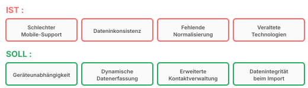
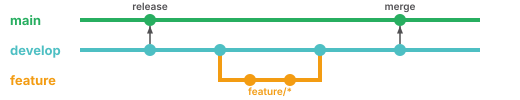
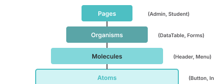
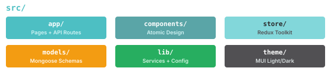
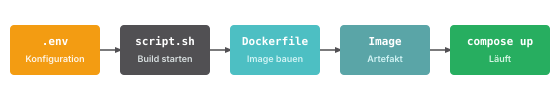
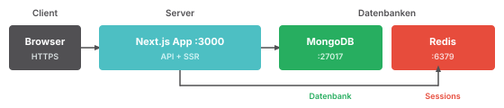
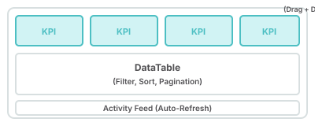
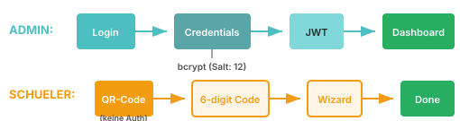
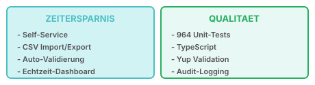

<!-- _class: title -->

# Digital Student Registration

v2.1.0 - Next.js 15 - React 19 - MongoDB - Docker

Philipp - Constantin - Valentin - Alex - David

---

  

    
AU

    
Willkommen

    
Admin User

    
Schulverwaltung

  

  

  
Einstellungen durchsuchen

  

    
1. Einleitung

    
2. Projektmanagement

    
3. Design - UI / UX

    
4. Anmeldung

    
5. Architektur

    
6. Deployment

    
7. Infrastruktur

    
8. Admin

    
9. Rechte

    
10. Wirtschaftlichkeit

  

  

    
    
Digital Student Registration v2.1.0

  

  

    <h2 class="content-title" style="font-size: 22px; font-weight: 800;">Einleitung</h2>
    

      
Suchen...

      
Speichern

    

  

  

<table class="large-table">
<tr><th>Aspekt</th><th>v1 (Alt)</th><th>v2 (Neu)</th></tr>
<tr><td><strong>Technologie</strong></td><td>Veraltet</td><td>Next.js 15, React 19</td></tr>
<tr><td><strong>UX</strong></td><td>Schlecht</td><td>Modern, Self-Service</td></tr>
<tr><td><strong>Wartbarkeit</strong></td><td>Schwierig</td><td>964 Unit-Tests</td></tr>
<tr><td><strong>Status</strong></td><td>Unübersichtlich</td><td>Echtzeit-Dashboard</td></tr>
</table>

  

---

  

    
AU

    
Willkommen

    
Admin User

    
Schulverwaltung

  

  

  
Einstellungen durchsuchen

  

    
1. Einleitung

    
2. Projektmanagement

    
3. Design - UI / UX

    
4. Anmeldung

    
5. Architektur

    
6. Deployment

    
7. Infrastruktur

    
8. Admin

    
9. Rechte

    
10. Wirtschaftlichkeit

  

  

    
    
Digital Student Registration v2.1.0

  

  

    <h2 class="content-title">Projektmanagement</h2>
    

      
Suchen...

      
Speichern

    

  

  

  <table class="large-table">
  <tr><th>Person</th><th>Verantwortlichkeit</th></tr>
  <tr><td><strong>Philipp</strong></td><td>Projektleitung, Wirtschaftlichkeit</td></tr>
  <tr><td><strong>Constantin</strong></td><td>Design, UX</td></tr>
  <tr><td><strong>Valentin</strong></td><td>Anmeldung, Architektur</td></tr>
  <tr><td><strong>Alex</strong></td><td>Deployment, Infrastruktur</td></tr>
  <tr><td><strong>David</strong></td><td>Admin, Sicherheit</td></tr>
  </table>

  

---

  

    
AU

    
Willkommen

    
Admin User

    
Schulverwaltung

  

  

  
Einstellungen durchsuchen

  

    
1. Einleitung

    
2. Projektmanagement

    
3. Design - UI / UX

    
4. Anmeldung

    
5. Architektur

    
6. Deployment

    
7. Infrastruktur

    
8. Admin

    
9. Rechte

    
10. Wirtschaftlichkeit

  

  

    
    
Digital Student Registration v2.1.0

  

  

    <h2 class="content-title">Design - UI / UX</h2>
    

      
Suchen...

      
Speichern

    

  

  

<table class="large-table">
<tr><th>Feature</th><th>Beschreibung</th></tr>
<tr><td><strong>Legasthenie-Schrift</strong></td><td>OpenDyslexic Font</td></tr>
<tr><td><strong>High Contrast</strong></td><td>Erhöhter Kontrast für Sehbehinderte</td></tr>
<tr><td><strong>i18n</strong></td><td>Deutsch / Englisch</td></tr>
<tr><td><strong>Theme Toggle</strong></td><td>Light und Dark Mode</td></tr>
</table>

  

  

---

  

    
AU

    
Willkommen

    
Admin User

    
Schulverwaltung

  

  

  
Einstellungen durchsuchen

  

    
1. Einleitung

    
2. Projektmanagement

    
3. Design - UI / UX

    
4. Anmeldung

    
5. Architektur

    
6. Deployment

    
7. Infrastruktur

    
8. Admin

    
9. Rechte

    
10. Wirtschaftlichkeit

  

  

    
    
Digital Student Registration v2.1.0

  

  

    <h2 class="content-title">Anmeldung</h2>
    

      
Suchen...

      
Speichern

    

  

  

<table class="mid-table">
  <tr><th>Schritt</th><th>Optional</th><th>Bedingung</th></tr>
  <tr><td>0: Willkommen</td><td>Nein</td><td>-</td></tr>
  <tr><td>1: Allgemein</td><td>Nein</td><td>-</td></tr>
  <tr><td><strong>2: Herkunft</strong></td><td><strong>Ja</strong></td><td>Geburtsland ≠ DE</td></tr>
  <tr><td>3-5: Adresse, Eltern, Bildung</td><td>Nein</td><td>-</td></tr>
  <tr><td><strong>6-7: Ausbildung, Betrieb</strong></td><td><strong>Ja</strong></td><td>Berufsausbildung</td></tr>
  <tr><td>8-10: Vereinbarungen, Übersicht, Fertig</td><td>Nein</td><td>-</td></tr>
</table>

  

---

  

    
AU

    
Willkommen

    
Admin User

    
Schulverwaltung

  

  

  
Einstellungen durchsuchen

  

    
1. Einleitung

    
2. Projektmanagement

    
3. Design - UI / UX

    
4. Anmeldung

    
5. Architektur

    
6. Deployment

    
7. Infrastruktur

    
8. Admin

    
9. Rechte

    
10. Wirtschaftlichkeit

  

  

    
    
Digital Student Registration v2.1.0

  

  

    <h2 class="content-title">Architektur</h2>
    

      
Suchen...

      
Speichern

    

  

  

<table class="mid-table">
  <tr><th>Technologie</th><th>Zweck</th><th>Beschreibung</th></tr>
  <tr><td>Next.js 15</td><td>App Router, SSR</td><td>React-Framework für Server-Side Rendering</td></tr>
  <tr><td>React 19</td><td>JS Framework</td><td>Komponentenbasierte UI-Bibliothek</td></tr>
  <tr><td>TypeScript 5</td><td>Typsicherheit</td><td>Statische Typprüfung für JavaScript</td></tr>
  <tr><td>Redux Toolkit</td><td>State Management</td><td>Zentraler Anwendungszustand</td></tr>
  <tr><td>Formik + Yup</td><td>Formulare</td><td>Formularhandling mit Validierung</td></tr>
  <tr><td>i18n</td><td>Internationalisierung</td><td>Mehrsprachigkeit (DE/EN)</td></tr>
  <tr><td>Sonner</td><td>Benachrichtigungen</td><td>Toast-Meldungen für Benutzer</td></tr>
</table>

  

---

  

    
AU

    
Willkommen

    
Admin User

    
Schulverwaltung

  

  

  
Einstellungen durchsuchen

  

    
1. Einleitung

    
2. Projektmanagement

    
3. Design - UI / UX

    
4. Anmeldung

    
5. Architektur

    
6. Deployment

    
7. Infrastruktur

    
8. Admin

    
9. Rechte

    
10. Wirtschaftlichkeit

  

  

    
    
Digital Student Registration v2.1.0

  

  

    <h2 class="content-title">Deployment</h2>
    

      
Suchen...

      
Speichern

    

  

  

<table class="large-table">
  <tr><th>Merkmal</th><th>Beschreibung</th></tr>
  <tr><td>Konsistent</td><td>Entwicklungs- und Produktionsumgebung identisch</td></tr>
  <tr><td>Schnell</td><td>Vollständiges Deployment in unter 5 Minuten</td></tr>
  <tr><td>Sicher</td><td>Rootless Container, keine Privilegien-Eskalation</td></tr>
  <tr><td>Plattform</td><td>Unterstützung für Linux und Windows</td></tr>
  <tr><td>Versioniert</td><td>Images werden mit Tags versioniert</td></tr>
</table>

  

---

  

    
AU

    
Willkommen

    
Admin User

    
Schulverwaltung

  

  

  
Einstellungen durchsuchen

  

    
1. Einleitung

    
2. Projektmanagement

    
3. Design - UI / UX

    
4. Anmeldung

    
5. Architektur

    
6. Deployment

    
7. Infrastruktur

    
8. Admin

    
9. Rechte

    
10. Wirtschaftlichkeit

  

  

    
    
Digital Student Registration v2.1.0

  

  

    <h2 class="content-title">Infrastruktur</h2>
    

      
Suchen...

      
Speichern

    

  

  

<table class="large-table">
  <tr><th>Service</th><th>Port</th><th>Beschreibung</th><th>Healthcheck</th></tr>
  <tr><td>App</td><td>3000</td><td>Next.js Anwendung</td><td><code>/api/health/live</code></td></tr>
  <tr><td>MongoDB</td><td>27017</td><td>Datenbank</td><td><code>mongosh ping</code></td></tr>
  <tr><td>Redis</td><td>6379</td><td>Session-Speicher</td><td><code>redis-cli ping</code></td></tr>
</table>

  

---

  

    
AU

    
Willkommen

    
Admin User

    
Schulverwaltung

  

  

  
Einstellungen durchsuchen

  

    
1. Einleitung

    
2. Projektmanagement

    
3. Design - UI / UX

    
4. Anmeldung

    
5. Architektur

    
6. Deployment

    
7. Infrastruktur

    
8. Admin

    
9. Rechte

    
10. Wirtschaftlichkeit

  

  

    
    
Digital Student Registration v2.1.0

  

  

    <h2 class="content-title">Admin</h2>
    

      
Suchen...

      
Speichern

    

  

  

<table class="mid-table">
  <tr><th>Bereich</th><th>Features</th></tr>
  <tr><td>Klassen</td><td>DataTable, CSV-Import/Export, QR-Codes</td></tr>
  <tr><td>Schüler</td><td>Filter, Inline-Assignment, Detailansicht</td></tr>
  <tr><td>Dashboard</td><td>Status-Übersicht, Statistiken</td></tr>
</table>

**Dashboard Layout:**

  

---

  

    
AU

    
Willkommen

    
Admin User

    
Schulverwaltung

  

  

  
Einstellungen durchsuchen

  

    
1. Einleitung

    
2. Projektmanagement

    
3. Design - UI / UX

    
4. Anmeldung

    
5. Architektur

    
6. Deployment

    
7. Infrastruktur

    
8. Admin

    
9. Rechte

    
10. Wirtschaftlichkeit

  

  

    
    
Digital Student Registration v2.1.0

  

  

    <h2 class="content-title">Rechte</h2>
    

      
Suchen...

      
Speichern

    

  

  

<table class="mid-table">
  <tr><th>Rolle</th><th>Zugriff</th></tr>
  <tr><td>Admin</td><td>Vollzugriff (JWT via NextAuth.js)</td></tr>
  <tr><td>Schüler</td><td>Unauthentifiziert (6-stelliger Code)</td></tr>
</table>

**Authentifizierungs-Flow:**

**Sicherheit:** Audit-Logging (90d) + Recovery-Codes + Redis Sessions

  

---

  

    
AU

    
Willkommen

    
Admin User

    
Schulverwaltung

  

  

  
Einstellungen durchsuchen

  

    
1. Einleitung

    
2. Projektmanagement

    
3. Design - UI / UX

    
4. Anmeldung

    
5. Architektur

    
6. Deployment

    
7. Infrastruktur

    
8. Admin

    
9. Rechte

    
10. Wirtschaftlichkeit

  

  

    
    
Digital Student Registration v2.1.0

  

  

    <h2 class="content-title">Wirtschaftlichkeit</h2>
    

      
Suchen...

      
Speichern

    

  

  

<table class="mid-table">
  <tr><th>Bereich</th><th>v1 (Alt)</th><th>v2 (Neu)</th></tr>
  <tr><td>Dateneingabe</td><td>Umständlich</td><td>Self-Service + CSV</td></tr>
  <tr><td>Fehlerquote</td><td>Hoch</td><td>Auto-Validierung</td></tr>
  <tr><td>Wartbarkeit</td><td>Schwierig</td><td><strong>964 Tests</strong></td></tr>
  <tr><td>Lizenzkosten</td><td>Unbekannt</td><td><strong>0 EUR</strong> (OSS)</td></tr>
</table>

**Vorteile v2:**

  

---

<!-- _class: title -->

# Fragen?

Digital Student Registration v2.1.0

Next.js 15 - React 19 - MongoDB - Docker
